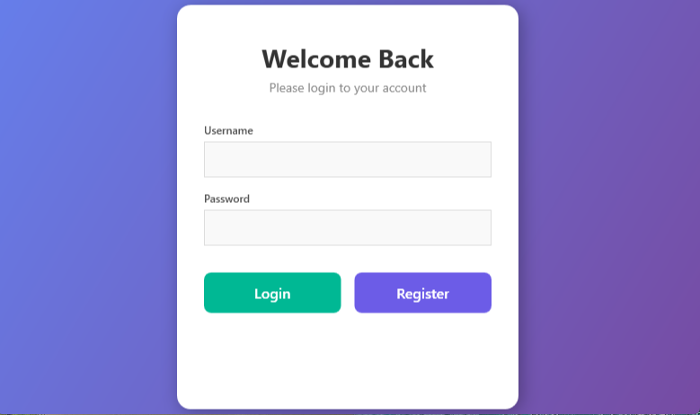
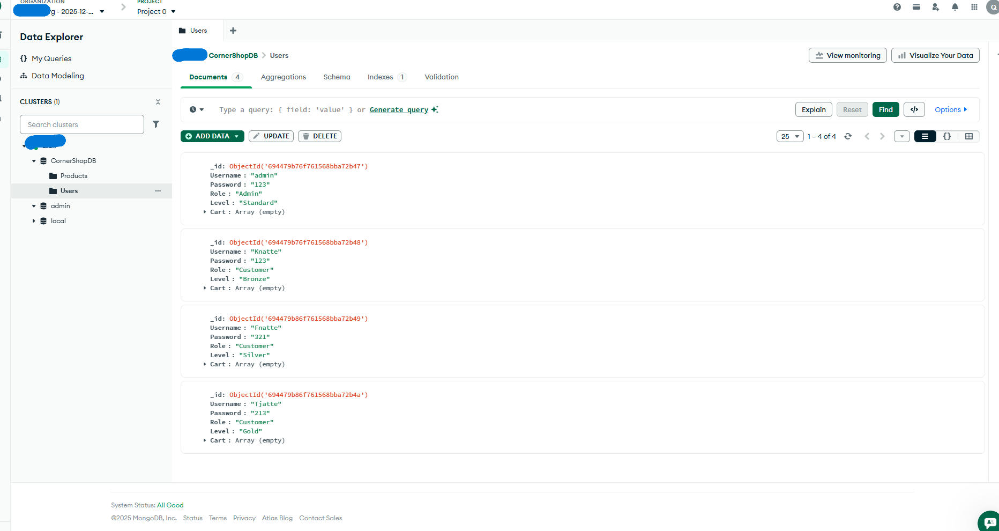

# ☁️ CornerShop (Modular E-commerce Solution)


**CornerShop** is a modular e-commerce solution that demonstrates a **Clean Architecture** approach. It separates the domain logic into a shared core library, accessed by multiple client interfaces including a **WPF Desktop App** and an **Admin Web API**.

## 🏗 Architecture & Design Patterns

The solution is structured into three distinct layers to ensure **Separation of Concerns (SoC)** and high maintainability:

### 1. 📦 CornerShop.Core (Shared Logic)
This is the heart of the application, serving as a shared class library.
- **Repository Pattern:** The `ShopRepository.cs` encapsulates all MongoDB database operations, ensuring that the UI layers are decoupled from direct database access.
- **Domain Models:** Centralized entity definitions (`Product`, `User`, `CartItem`) used across the entire solution.
- **Database Configuration:** Centralized `DBConfig` for managing MongoDB connections.

### 2. 🖥️ CornerShop (WPF Client)
A rich desktop client built using the **MVVM (Model-View-ViewModel)** design pattern.
- **ViewModels:** Contains the presentation logic, handling state and commands (e.g., `RelayCommand`), keeping the code-behind (`.xaml.cs`) clean.
- **Views:** Pure XAML user interfaces bound to ViewModels via DataBinding.
- **Async UI:** Utilizes `async/await` for all repository calls to maintain a responsive UI.

### 3. 🌐 CornerShop.AdminAPI (Web API)
A RESTful API project built with ASP.NET Core.
- Provides endpoints for administrative tasks.
- Reuses the **same** `CornerShop.Core` library, demonstrating code reusability between Desktop and Web environments.

## 📸 Cloud & Interface Preview

**1. Desktop UI (WPF)**
*The user interface listing products fetched directly from the cloud.*


**2. Cloud Backend (MongoDB Atlas)**
*Real-time data persistence verification in the MongoDB Atlas Cluster.*


## 🛠 Tech Stack

- **Language:** C# 10 / .NET 8
- **Database:** MongoDB Atlas (Cloud NoSQL)
- **ORM/Driver:** MongoDB.Driver
- **Desktop UI:** WPF (Windows Presentation Foundation) with MVVM
- **Web Services:** ASP.NET Core Web API
- **Tools:** Visual Studio 2022, Swagger (for API testing)

## 💻 Code Highlight: The Repository Pattern

*The application uses a generic-style repository approach in `ShopRepository.cs` to handle CRUD operations asynchronously:*

```csharp
public async Task<List<Product>> GetAllProductsAsync()
{
    // Accessing the collection via the shared Core library configuration
    var collection = _db.GetCollection<Product>("Products");
    return await collection.Find(_ => true).ToListAsync();
}

## 🚀 How to Run

To run this solution locally, you need to configure the database connection string in the code.

1.  **Clone the repository**
    ```bash
    git clone https://github.com/Qian1507/CornerShop.git
    ```

2.  **Configuration (Critical Step!)**
    - Navigate to `CornerShop.Core/Data/DBConfig.cs`.
    - Locate the `CloudConnection` variable.
    - **Replace the placeholder string** with your own **MongoDB Atlas Connection String**:
      ```csharp
      // inside DBConfig.cs
      private const string CloudConnection = "mongodb+srv://<username>:<password>@cluster...";
      ```
    - *Note:* You can also set `public static bool UseCloud = false;` to use a local MongoDB instance (`localhost:27017`).

3.  **Run the Application**
    - Open the solution in **Visual Studio**.
    - Set **CornerShop** (WPF) as the startup project to run the Desktop App.
    - Set **CornerShop.AdminAPI** as the startup project if you want to test the Backend API (Swagger).

---
**⚠️ Security Note:** The connection string has been removed from the source code for security reasons. You must provide your own database credentials to run the app.
